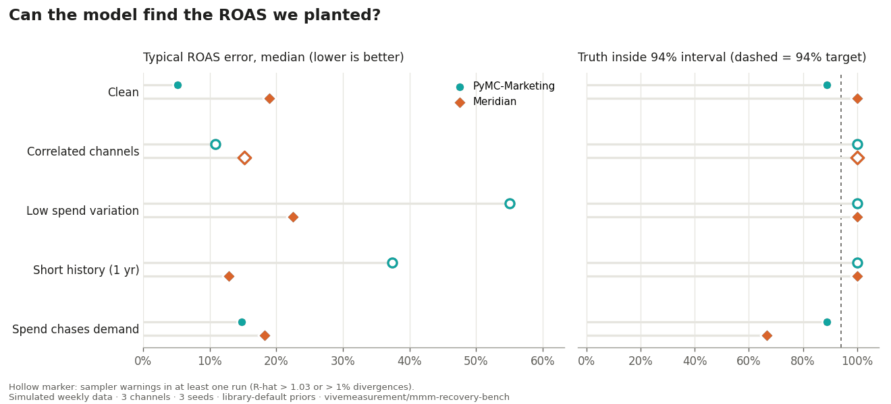

# MMM Recovery Bench

**Can open-source marketing mix models find the ROAS we planted?**

We simulate weekly sales where the true return on every channel is known, fit PyMC-Marketing and Google Meridian with their default settings, and score how close each gets. We then break the data in the ways real data is broken (correlated channels, flat budgets, short history, spend that chases demand) and watch what happens.



[](https://colab.research.google.com/github/vivemeasurement/mmm-recovery-bench/blob/main/notebooks/quickstart.ipynb)
&nbsp;Rerun one scenario yourself in about three minutes, no setup.

## What we found

<!-- findings:start -->
1. **On clean data, PyMC-Marketing is sharper.** Typical ROAS error was 5% against Meridian's 19%, with intervals half as wide.
2. **Meridian degrades more gracefully.** Its ROI priors kept typical error between 13% and 22% in every scenario. PyMC-Marketing drifted to 37 to 55% with flat budgets or a single year of data, and its sampler raised warnings there. PyMC-Marketing's intervals did widen (up to ±268%), so the model was at least admitting it didn't know.
3. **Spend that chases demand is the dangerous case.** Both tools over-credited search. Meridian put search ROAS near 4.9 against a true 2.3, and its interval missed the truth in all three runs: confident and wrong. PyMC-Marketing overstated search too (about 3.3) but kept the truth inside a wider interval. No sampler setting fixes confounding; a lift test on search does.
4. **One dataset tells you little.** Changing only the random seed moved PyMC-Marketing's clean-data error from 6% to 53%. Treat any single MMM read as one draw, not the answer.

<sub>Preview run: 3 seeds, 2 chains × 500 draws. Some PyMC-Marketing sampler warnings may come from these shorter chains; the full 4 × 1000 run will update this page.</sub>
<!-- findings:end -->

## Results

<!-- results:start -->
| Scenario | Tool | Median ROAS error | Truth inside 94% interval | Interval width | Runs with sampler warnings |
|---|---|---:|---:|---:|---:|
| Clean | Meridian | 19% | 100% | ±63% | 0 of 3 |
| Clean | PyMC-Marketing | 5% | 89% | ±30% | 0 of 3 |
| Correlated channels | Meridian | 15% | 100% | ±73% | 1 of 3 |
| Correlated channels | PyMC-Marketing | 11% | 100% | ±110% | 1 of 3 |
| Low spend variation | Meridian | 22% | 100% | ±62% | 0 of 3 |
| Low spend variation | PyMC-Marketing | 55% | 100% | ±268% | 3 of 3 |
| Short history (1 yr) | Meridian | 13% | 100% | ±71% | 0 of 3 |
| Short history (1 yr) | PyMC-Marketing | 37% | 100% | ±54% | 1 of 3 |
| Spend chases demand | Meridian | 18% | 67% | ±20% | 0 of 3 |
| Spend chases demand | PyMC-Marketing | 15% | 89% | ±30% | 0 of 3 |
<!-- results:end -->

**How to read it.** *Median ROAS error* is the typical absolute gap between estimated and true ROAS, across three channels and three seeds. *Truth inside 94% interval* is how often the true ROAS fell inside the model's own uncertainty interval: a well-calibrated model should be close to 94%. *Interval width* is the half-width of that interval relative to the true ROAS. A model that is wrong **and** confident (high error, low coverage, narrow interval) is the dangerous case.

## The scenarios

Every scenario uses the same true adstock, saturation and effect sizes for TV, Social and Search. Only the spend pattern changes.

| Scenario | What changes | Why it matters |
|---|---|---|
| Clean | Independent channels, healthy week-to-week variation, 3 years | The best case. If a tool misses here, stop. |
| Correlated channels | 80% of spend movement is shared across channels | Budgets are planned together, so the data can't tell channels apart. |
| Low spend variation | Always-on budgets with little change | No variation, nothing to learn from. |
| Short history | One year of weekly data | Most brands start here. |
| Spend chases demand | Search spend rises when demand rises anyway | Confounding: the classic way MMM over-credits search. |

Ground truth: geometric adstock (decay 0.6 TV, 0.3 Social, 0.1 Search), logistic saturation, trend, yearly seasonality, a promo and Gaussian noise. See [`bench/simulate.py`](bench/simulate.py).

## Fair-play rules

- **Library defaults.** Each tool gets the same data, the same control variables (promo and trend) and its own default priors. No tuning per scenario, so nobody is flattered by our choices.
- **Same scoring for everyone.** ROAS is incremental sales divided by spend, computed from each tool's posterior over the full period ([`bench/score.py`](bench/score.py)).
- **Pinned versions** in [`requirements.txt`](requirements.txt). Every row of [`results/results.csv`](results/results.csv) records the tool version, seed, chains, draws, runtime and convergence diagnostics.
- **Independent.** Not affiliated with or funded by any of the tools benchmarked.

## Run it yourself

```bash
git clone https://github.com/vivemeasurement/mmm-recovery-bench && cd mmm-recovery-bench
pip install -r requirements.txt
python run.py --quick                                   # smoke test, a few minutes
python run.py --seeds 0 1 2                             # full run: 4 chains x 1000 draws
python run.py --tools pymc --scenarios endogenous       # one tool, one scenario
python report.py                                        # rebuild the chart and tables
```

Or trigger **Actions → Run benchmark** on your fork; it commits fresh results back.

## Roadmap

- [ ] **Robyn** (R): runner in progress. Robyn is a ridge regression with bootstrapped intervals, so its intervals need careful comparison with Bayesian ones.
- [ ] Geo-level data, where Meridian's hierarchical model should shine
- [ ] Calibrating with a lift test: how much does one experiment fix the confounded scenario?
- [ ] Prior sensitivity: how much of each result is the default prior talking?

Have a failure mode we should test? [Propose a scenario](../../issues/new/choose). Stuck on your own model? [Ask a measurement question](../../discussions).

## About

Built by [Vijay Velpula](https://www.linkedin.com/in/vijayvelpula) at [Vive Measurement](https://github.com/vivemeasurement). Walkthroughs of these results go out as [YouTube Shorts](https://www.youtube.com/@vivemeasurement) and on [LinkedIn](https://www.linkedin.com/in/vijayvelpula).

If you use the benchmark, please cite it ([`CITATION.cff`](CITATION.cff)). MIT licensed.
